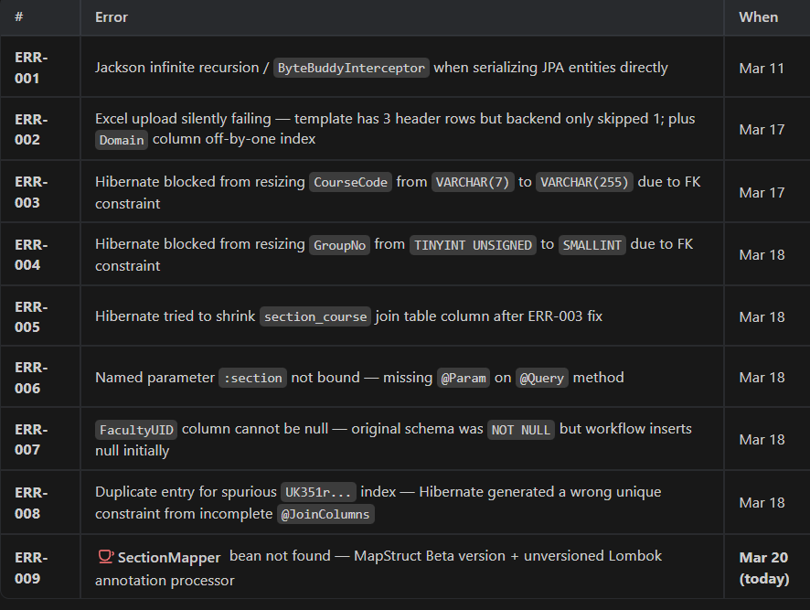

# University Timetable Management — Error Log & Fixes

> A running record of every error encountered during development, the root cause analysis, and the exact fix applied.
> Maintained to avoid repeating mistakes and as reference for future debugging.

---

## Table of Contents

1. [ERR-001 — JSON Serialization / Infinite Recursion](#err-001)
2. [ERR-002 — File Upload Rows Being Skipped / Domain Off-by-One](#err-002)
3. [ERR-003 — Hibernate Column Resize Blocked by Foreign Key (CourseCode)](#err-003)
4. [ERR-004 — Hibernate Column Resize Blocked by Foreign Key (GroupNo / TINYINT UNSIGNED)](#err-004)
5. [ERR-005 — Section–Course Join Table Column Length Mismatch](#err-005)
6. [ERR-006 — InvalidDataAccessApiUsageException: Missing @Param in JPQL Query](#err-006)
7. [ERR-007 — DataIntegrityViolationException: NOT NULL Constraint on coursemapping](#err-007)
8. [ERR-008 — Duplicate Entry for UK... (Stale Hibernate-Generated Unique Key)](#err-008)
9. [ERR-009 — MapStruct Bean Not Found (SectionMapper) at Spring Startup](#err-009)

---

<a name="err-001"></a>
## ERR-001 — JSON Serialization / Infinite Recursion

| Field       | Detail |
|-------------|--------|
| **Date**    | 2026-03-11 |
| **Type**    | Runtime — Jackson Serialization |
| **Layer**   | Backend (REST response) |

### Error Message
```
com.fasterxml.jackson.databind.exc.InvalidDefinitionException:
No serializer found for class org.hibernate.proxy.pojo.bytebuddy.ByteBuddyInterceptor
```
or a `StackOverflowError` from infinite recursion on bidirectional JPA relationships.

### Root Cause
JPA entities with `@OneToMany`/`@ManyToOne` bidirectional relationships were being directly serialized by Jackson. Jackson follows every reference recursively → infinite loop.
Also, Hibernate lazy-load proxies cannot be serialized directly — Jackson doesn't know how to handle `ByteBuddyInterceptor`.

### Fix Applied
- Annotated parent-side fields with `@JsonManagedReference` and child-side with `@JsonBackReference`.
- Alternatively used `@JsonIgnore` on the back-reference side of relationships that don't need to be serialized.
- Introduced DTOs (Data Transfer Objects) for all API responses so entity internals are never directly exposed to Jackson.

### Key Files Changed
- `Course.java`, `Section.java`, `Faculty.java`, `Room.java` — Added Jackson annotations
- `CourseDto.java`, `SectionDto.java`, `FacultyDto.java` — New DTO classes
- `CourseMapper.java`, `SectionMapper.java`, `FacultyMapper.java` — MapStruct mappers

### Lesson Learned
> **Never return JPA entities directly from controllers.** Always map to a DTO first. This sidesteps serialization issues completely and gives you full control over what fields are exposed in the API.

---

<a name="err-002"></a>
## ERR-002 — File Upload Rows Being Skipped / Domain Off-by-One

| Field       | Detail |
|-------------|--------|
| **Date**    | 2026-03-17 |
| **Type**    | Logic Bug — Excel Parsing |
| **Layer**   | Backend (Upload Services) |

### Error Message
No explicit exception — data that appeared correct during client-side validation would fail to upload, or the `Domain` field would be read from the wrong column.

### Root Cause
Two related issues:
1. **Three-row header**: The frontend Excel template generates **3 rows** before actual data (Row 1: headers, Row 2: description/type hints, Row 3: example data). The backend `UploadCourseFileService` was only skipping **1 row** with `if (rowIndex++ == 0) continue;`. This caused the description and example rows to be parsed as real course data, triggering validation failures.
2. **Off-by-one column index**: The `Domain` field in `UploadCourseFileService` was reading from `row.getCell(8)` instead of `row.getCell(7)` — a column index that was off by 1, causing `Domain` to always be empty (reading `Remarks` by mistake).

### Fix Applied

**All 4 upload services** changed the skip condition:
```java
// BEFORE (only skipped 1 row — the header)
if (rowIndex++ == 0) continue;

// AFTER (skips header + description + example rows)
if (rowIndex++ < 3) continue;
```

**Column index corrected** in `UploadCourseFileService`:
```java
// BEFORE
Cell domainCell = row.getCell(8); // Wrong — this is Remarks column

// AFTER
Cell domainCell = row.getCell(7); // Correct — this is Domain column
```

### Key Files Changed
- `UploadCourseFileService.java`
- `UploadRoomFileService.java`
- `UploadFacultyFileService.java`
- `UploadSectionFileService.java`

### Lesson Learned
> When the frontend template has header/example rows above the data, the backend skip count **must exactly match** the number of non-data rows. Always verify column index alignment against the exact template output — a 0-vs-1 index difference can silently read the wrong column for the entire upload.

---

<a name="err-003"></a>
## ERR-003 — Hibernate Column Resize Blocked by Foreign Key (CourseCode)

| Field       | Detail |
|-------------|--------|
| **Date**    | 2026-03-17 |
| **Type**    | Startup Failure — HibernateException / CommandAcceptanceException |
| **Layer**   | Backend (JPA / Database Schema) |

### Error Message
```
CommandAcceptanceException: Error executing DDL "alter table coursemaster modify column CourseCode varchar(255)"
Caused by: java.sql.SQLIntegrityConstraintViolationException: Cannot change column 'CourseCode':
used in a foreign key constraint 'section_course_ibfk_1'
```

### Root Cause
`Hibernate ddl-auto: update` tried to automatically resize `CourseCode` in the `coursemaster` table from `VARCHAR(7)` (as defined in the SQL migration script) to `VARCHAR(255)` (Hibernate's default `@Column` length). MySQL blocked this because `section_course` references `CourseCode` via a foreign key and the types must remain identical.

### Fix Applied
Added an explicit `length` to the `@Column` annotation on `CourseCode` in `Course.java`:
```java
// BEFORE
@Id
@Column(name = "CourseCode")
private String courseCode;

// AFTER
@Id
@Column(name = "CourseCode", length = 7)
private String courseCode;
```
This tells Hibernate the column is already the correct size, so it skips the alteration.

### Key Files Changed
- `Course.java` — Added `length = 7` to `@Column`

### Lesson Learned
> When using `ddl-auto: update` with manually created SQL migration scripts (like Flyway), **always annotate `@Column` with the exact `length` / `columnDefinition` that matches the database script**. Otherwise Hibernate will assume its own defaults and try to alter the column, which breaks when foreign keys are involved. Consider switching to `ddl-auto: validate` in production.

---

<a name="err-004"></a>
## ERR-004 — Hibernate Column Resize Blocked by Foreign Key (GroupNo / TINYINT UNSIGNED)

| Field       | Detail |
|-------------|--------|
| **Date**    | 2026-03-18 |
| **Type**    | Startup Failure — CommandAcceptanceException |
| **Layer**   | Backend (JPA / Database Schema) |

### Error Message
```
CommandAcceptanceException: Error executing DDL "alter table coursemapping modify column GroupNo smallint"
Caused by: Cannot change column 'GroupNo': used in a foreign key constraint 'ticket_ibfk_1'
```

### Root Cause
`GroupNo` is mapped to Java `Short` in both `CourseMapping.java` and `Ticket.java`. Hibernate maps `Short` → `SMALLINT` by default. However, the Flyway migration script `V1__first_script.sql` created `GroupNo` as `TINYINT UNSIGNED`. The `ticket` table references `coursemapping.GroupNo` via a foreign key. MySQL blocked the type change because it would break referential integrity between the two tables.

### Fix Applied
Added `columnDefinition = "TINYINT UNSIGNED"` explicitly to both entities so Hibernate stops trying to change the column type:

```java
// CourseMapping.java
@Column(name = "GroupNo", columnDefinition = "TINYINT UNSIGNED")
private Short groupNo;

// Ticket.java
@Column(name = "GroupNo", columnDefinition = "TINYINT UNSIGNED")
private Short groupNo;
```

Also applied the same fix preventatively to `L`, `T`, `P` columns in `CourseMapping.java` and `LectureNo` in `Ticket.java`.

### Key Files Changed
- `CourseMapping.java` — Added `columnDefinition` for `GroupNo`, `L`, `T`, `P`
- `Ticket.java` — Added `columnDefinition` for `GroupNo`, `LectureNo`

### Lesson Learned
> MySQL `TINYINT UNSIGNED` is **not directly mapped** by Hibernate/JPA's standard type system. If your SQL uses unsigned types, you **must** use `columnDefinition` in the JPA annotation to specify the exact SQL type. Otherwise Hibernate picks the closest signed equivalent and tries to alter your schema.

---

<a name="err-005"></a>
## ERR-005 — Section–Course Join Table Column Length Mismatch

| Field       | Detail |
|-------------|--------|
| **Date**    | 2026-03-18 |
| **Type**    | Startup Failure — CommandAcceptanceException |
| **Layer**   | Backend (JPA / Database Schema) |

### Error Message
```
CommandAcceptanceException: Error executing DDL
"alter table section_course modify column course_code varchar(7)"
```

### Root Cause
The Flyway `V2__second_script.sql` created the `section_course` join table with `course_code VARCHAR(255)`. Hibernate, now knowing from the fix in ERR-003 that `CourseCode` in `coursemaster` is `VARCHAR(7)`, tried to shrink the join table's `course_code` column to `VARCHAR(7)` to match. MySQL blocked this alteration because `section_course` is part of a foreign key relationship.

### Fix Applied
Added `columnDefinition = "VARCHAR(255)"` to the `inverseJoinColumns` mapping for `course_code` in `Section.java`:
```java
@ManyToMany
@JoinTable(
    name = "section_course",
    joinColumns = @JoinColumn(name = "section_id"),
    inverseJoinColumns = @JoinColumn(
        name = "course_code",
        columnDefinition = "VARCHAR(255)"  // <-- Added this
    )
)
private List<Course> courses;
```

### Key Files Changed
- `Section.java` — Added `columnDefinition = "VARCHAR(255)"` to `@JoinColumn`

### Lesson Learned
> Column definitions on join tables must also be explicitly annotated if the join column's type differs from the referenced column's declaration. The fix for one mismatch (ERR-003) can expose a second mismatch in a join table — always check all usages of a corrected column type.

---

<a name="err-006"></a>
## ERR-006 — InvalidDataAccessApiUsageException: Missing @Param in JPQL Query

| Field       | Detail |
|-------------|--------|
| **Date**    | 2026-03-18 |
| **Type**    | Runtime — Spring Data JPA |
| **Layer**   | Backend (Repository Layer) |

### Error Message
```
org.springframework.dao.InvalidDataAccessApiUsageException:
Named parameter not bound : section
```

### Root Cause
`CourseMappingRepository` had a custom `@Query` that used named parameters `:section` and `:coursecode`, but the method arguments were not annotated with `@Param`. Spring Data JPA requires `@Param` when using named parameters in `@Query` annotations — without it, Spring cannot bind the method argument to the query placeholder.

### Fix Applied
```java
// BEFORE
@Query("SELECT COUNT(c) > 0 FROM CourseMapping c WHERE c.section = :section AND c.coursecode = :coursecode")
boolean existsBySectionAndCoursecode(String section, String coursecode);

// AFTER
@Query("SELECT COUNT(c) > 0 FROM CourseMapping c WHERE c.section = :section AND c.coursecode = :coursecode")
boolean existsBySectionAndCoursecode(
    @Param("section") String section,
    @Param("coursecode") String coursecode
);
```

### Key Files Changed
- `CourseMappingRepository.java` — Added `@Param` to method parameters

### Lesson Learned
> In Spring Data JPA, `@Param` is **mandatory** when using named parameters (`:paramName`) in `@Query` annotations. Without it, parameter binding silently fails if Spring cannot infer the name from bytecode (e.g., when compiled without debug information). Always add `@Param` explicitly.

---

<a name="err-007"></a>
## ERR-007 — DataIntegrityViolationException: NOT NULL Constraint on coursemapping

| Field       | Detail |
|-------------|--------|
| **Date**    | 2026-03-17 |
| **Type**    | Runtime — Database Constraint Violation |
| **Layer**   | Backend (Service → Database) |

### Error Message
```
org.springframework.dao.DataIntegrityViolationException:
Column 'FacultyUID' cannot be null
```

### Root Cause
During the section-to-course assignment flow, `AssignService` creates `CourseMapping` records with `FacultyUID`, `Mergecode`, and `Reserveslot` left as `null` (they get filled in later during the faculty assignment step). However, the original `V1__first_script.sql` created these columns as `NOT NULL` in the `coursemapping` table. MySQL rejected the insert because the mandatory fields had no value.

### Fix Applied
Created a new Flyway migration script `V3__third_script.sql` to alter the existing table and drop the `NOT NULL` constraints:
```sql
ALTER TABLE coursemapping
  MODIFY COLUMN FacultyUID VARCHAR(255) NULL,
  MODIFY COLUMN Mergecode VARCHAR(255) NULL,
  MODIFY COLUMN Reserveslot VARCHAR(255) NULL;
```

> **Why a new migration script and not changing V1?** Flyway tracks which scripts have already run using checksums. Modifying an existing script would cause Flyway to fail with a checksum mismatch on a database that already applied `V1`. A new `V3` migration safely applies only on databases that don't have it yet.

### Key Files Changed
- `V3__third_script.sql` — New Flyway migration that relaxes NOT NULL constraints

### Lesson Learned
> Design your initial schema with the application's data lifecycle in mind. If a field is populated in a **later stage** of the workflow (e.g., faculty assignment happens after course mapping), it **must** allow `NULL` in the initial insert. Alternatively, provide a default value. Never modify already-applied Flyway scripts — always create a new numbered migration.

---

<a name="err-008"></a>
## ERR-008 — Duplicate Entry for UK... (Stale Hibernate-Generated Unique Key)

| Field       | Detail |
|-------------|--------|
| **Date**    | 2026-03-18 |
| **Type**    | Runtime — DataIntegrityViolationException |
| **Layer**   | Backend (Service → Database) |

### Error Message
```
org.springframework.dao.DataIntegrityViolationException:
Duplicate entry 'CSE101-1-1' for key 'coursemapping.UK351r146c25yq45y9c8eavebv7'
```

### Root Cause
This was a **Hibernate-generated** unique constraint that should never have existed.

The `Ticket` entity had a `@ManyToOne` relationship pointing to `CourseMapping` using 3 join columns: `Section`, `Coursecode`, and `GroupNo`. Because `MappingType` (the 4th part of the composite key) was **missing** from the join columns, Hibernate wrongly inferred that `(Section, Coursecode, GroupNo)` alone must be unique in `coursemapping`. On application startup with `ddl-auto: update`, Hibernate automatically **created a unique index** `UK351r146c25yq45y9c8eavebv7` enforcing this incorrect uniqueness.

The actual business logic creates multiple `CourseMapping` rows for the same `(Section, Coursecode, GroupNo)` — one for each `MappingType` (L=Lecture, T=Tutorial, P=Practical) — so this spurious unique constraint caused `Duplicate entry` on the second insert.

### Fix Applied — Two Parts

**Part 1 — Code fix** (prevents the problem permanently):
Completely removed the `@ManyToOne CourseMapping courseMappingEntity` field and its JPA relationship from `Ticket.java`. By eliminating this JPA-level relationship, Hibernate no longer tries to interpret any uniqueness for `CourseMapping` based on partial keys and stops generating the constraint on startup.
```java
// REMOVED from Ticket.java:
@ManyToOne
@JoinColumns({
    @JoinColumn(name = "Section", referencedColumnName = "Section"),
    @JoinColumn(name = "Coursecode", referencedColumnName = "Coursecode"),
    @JoinColumn(name = "GroupNo", referencedColumnName = "GroupNo")
})
private CourseMapping courseMappingEntity;
```
The raw database foreign key still works normally — only the JPA-level mapping was removed.

**Part 2 — Database cleanup fix** (drops the stale index from existing databases):
Created `V4__fourth_script.sql` with a stored procedure that safely checks for and drops the index if it exists:
```sql
DROP PROCEDURE IF EXISTS drop_uk_if_exists;
DELIMITER //
CREATE PROCEDURE drop_uk_if_exists()
BEGIN
  IF EXISTS (
    SELECT 1 FROM INFORMATION_SCHEMA.STATISTICS
    WHERE TABLE_SCHEMA = DATABASE()
      AND TABLE_NAME = 'coursemapping'
      AND INDEX_NAME = 'UK351r146c25yq45y9c8eavebv7'
  ) THEN
    ALTER TABLE coursemapping DROP INDEX UK351r146c25yq45y9c8eavebv7;
  END IF;
END //
DELIMITER ;
CALL drop_uk_if_exists();
DROP PROCEDURE IF EXISTS drop_uk_if_exists;
```

### Key Files Changed
- `Ticket.java` — Removed the incomplete `@ManyToOne` relationship to `CourseMapping`
- `V4__fourth_script.sql` — New Flyway migration that conditionally drops the stale unique index

### Lesson Learned
> `ddl-auto: update` is **dangerous** in production and even in development: Hibernate silently modifies your schema based on what it infers from entity annotations. An incomplete `@JoinColumns` mapping (missing part of a composite key) can cause Hibernate to create a spurious unique constraint. **Always audit Hibernate's generated DDL statements** in the startup logs, especially when using composite keys. A full `@JoinColumns` must include ALL parts of the composite primary key.

---

<a name="err-009"></a>
## ERR-009 — MapStruct Bean Not Found (SectionMapper) at Spring Startup

| Field       | Detail |
|-------------|--------|
| **Date**    | 2026-03-20 |
| **Type**    | Startup Failure — NoSuchBeanDefinitionException |
| **Layer**   | Backend (Spring DI / MapStruct) |

### Error Message
```
Parameter 3 of constructor in com.capstone.University.Time.Table.manager.Service.AssignService
required a bean of type 'com.capstone.University.Time.Table.manager.Mapper.SectionMapper'
that could not be found.

Action: Consider defining a bean of type
'com.capstone.University.Time.Table.manager.Mapper.SectionMapper' in your configuration.

Process finished with exit code 1
```

### Root Cause
`SectionMapper` is a MapStruct interface annotated with `@Mapper(componentModel = "spring")`. MapStruct works as a **compile-time annotation processor** — it reads the interface and generates a concrete `SectionMapperImpl` class that is annotated with Spring's `@Component`, making it a Spring-managed bean.

The problem was that `pom.xml` was using MapStruct version `1.6.0.Beta1` — an unstable beta release. Two issues existed:
1. **Beta version instability** — the beta annotation processor did not reliably generate the `SectionMapperImpl` class as a proper Spring component, so no bean was registered.
2. **Missing Lombok version pin** — the Lombok path in `<annotationProcessorPaths>` had no `<version>` tag, so Maven could pick a mismatched version. Lombok must run **before** MapStruct in the annotation processor chain (to process `@Getter`/`@Setter` on entities before MapStruct reads their methods). Without an explicit version, the ordering could be violated, silently breaking code generation.

### Fix Applied

Updated `pom.xml`:

**1. MapStruct version → stable `1.6.3`:**
```xml
<!-- BEFORE -->
<dependency>
    <groupId>org.mapstruct</groupId>
    <artifactId>mapstruct</artifactId>
    <version>1.6.0.Beta1</version>
</dependency>

<!-- AFTER -->
<dependency>
    <groupId>org.mapstruct</groupId>
    <artifactId>mapstruct</artifactId>
    <version>1.6.3</version>
</dependency>
```

**2. Annotation processor order corrected — Lombok FIRST, then MapStruct:**
```xml
<annotationProcessorPaths>
    <!-- Lombok MUST come first so it processes @Getter/@Setter before MapStruct reads methods -->
    <path>
        <groupId>org.projectlombok</groupId>
        <artifactId>lombok</artifactId>
        <version>1.18.36</version>  <!-- Pinned explicitly -->
    </path>
    <path>
        <groupId>org.projectlombok</groupId>
        <artifactId>lombok-mapstruct-binding</artifactId>
        <version>0.2.0</version>
    </path>
    <path>
        <groupId>org.mapstruct</groupId>
        <artifactId>mapstruct-processor</artifactId>
        <version>1.6.3</version>  <!-- Updated from Beta1 -->
    </path>
</annotationProcessorPaths>
```

After the `pom.xml` fix, a **full `mvn clean install`** (or IntelliJ's Maven → clean → install) is required to force recompilation — simply running the app again is not enough as the stale `.class` files from the failed beta version may persist.

### Key Files Changed
- `pom.xml` — Updated MapStruct version and pinned Lombok version in annotation processors

### How to Rebuild After This Fix
Since `JAVA_HOME` may not be set in a plain terminal, use IntelliJ:
1. Open **Maven** panel (right sidebar)
2. Run **Lifecycle → clean**, then **Lifecycle → install** (with `-DskipTests`)
3. Then start the Spring Boot application normally

### Lesson Learned
> - **Never use Beta/RC versions** of annotation processors in a project — they can silently fail to generate code with no obvious error beyond a missing bean at runtime.
> - **Always pin explicit versions** for all entries in `<annotationProcessorPaths>`. Maven does not automatically resolve versions for processor paths from your `<dependencyManagement>` section.
> - **Annotation processor order matters**: Lombok must run before MapStruct. The correct order in `<annotationProcessorPaths>` is: `lombok` → `lombok-mapstruct-binding` → `mapstruct-processor`.
> - After any `pom.xml` annotation processor change, always do a **full clean build** — incremental builds will not re-run the annotation processor on already-compiled files.

---

## Quick Reference Table

| ID | Error | Layer | Root Cause Summary | Fix Summary |
|----|-------|-------|-------------------|-------------|
| ERR-001 | Jackson infinite recursion / ByteBuddyInterceptor | Backend REST | Direct JPA entity serialization | Introduced DTOs + MapStruct mappers |
| ERR-002 | File upload silently skipping / wrong column | Backend Upload | Template has 3 header rows; backend skipped only 1. Column index off by 1 | Changed skip to `rowIndex++ < 3`; fixed column index |
| ERR-003 | Hibernate can't resize CourseCode (FK blocks) | Backend Schema | Hibernate default VARCHAR(255) vs actual VARCHAR(7) in FK-constrained column | Added `length = 7` to `@Column` on `Course.java` |
| ERR-004 | Hibernate can't resize GroupNo (FK blocks) | Backend Schema | `Short` maps to SMALLINT; DB has TINYINT UNSIGNED in FK-constrained column | Added `columnDefinition = "TINYINT UNSIGNED"` |
| ERR-005 | Hibernate can't resize join table course_code | Backend Schema | After ERR-003 fix, Hibernate tried to shrink join table column | Added `columnDefinition = "VARCHAR(255)"` to `@JoinColumn` |
| ERR-006 | Named parameter not bound `:section` | Backend Repo | Missing `@Param` on `@Query` method arguments | Added `@Param` annotations to repository method |
| ERR-007 | Column 'FacultyUID' cannot be null | Backend DB | Original schema had NOT NULL; workflow inserts with null at first | New Flyway V3 migration to make columns nullable |
| ERR-008 | Duplicate entry for spurious UK... index | Backend DB | Incomplete `@JoinColumns` caused Hibernate to generate wrong unique constraint | Removed invalid `@ManyToOne` in `Ticket.java`; V4 migration drops stale index |
| ERR-009 | SectionMapper bean not found at startup | Backend DI | MapStruct Beta version + unversioned Lombok in annotation processors | Updated MapStruct to 1.6.3; pinned Lombok 1.18.36; fixed processor order |


